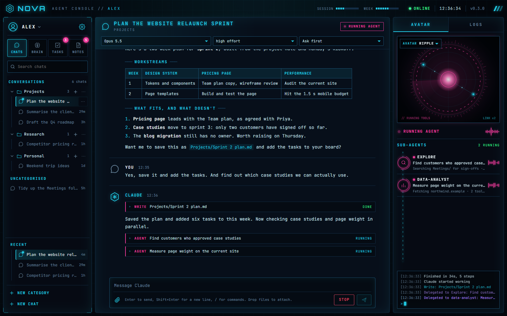
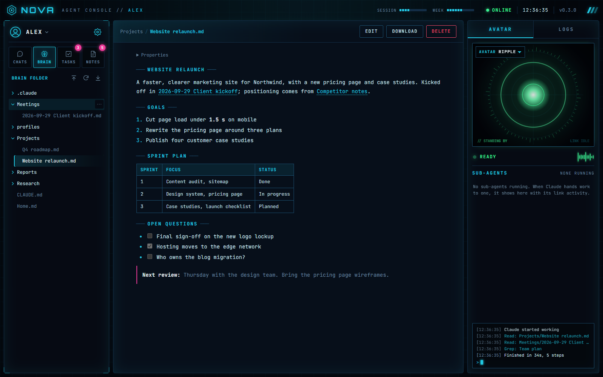
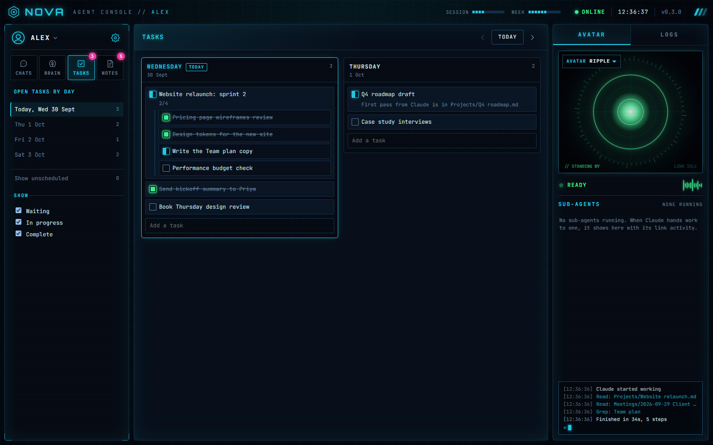
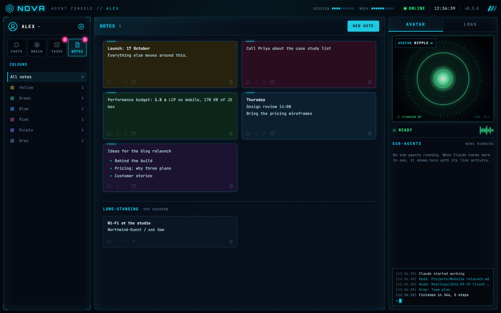
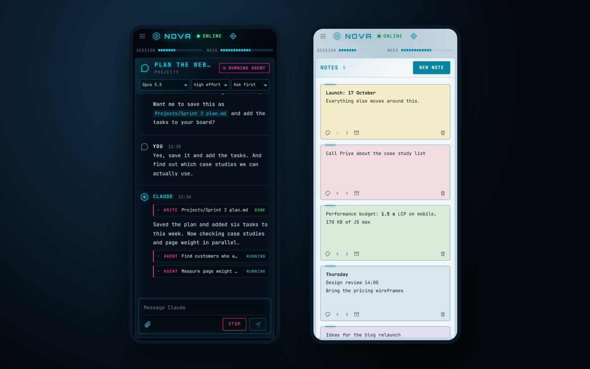

# Nova

**A home for Claude Code's agent, in your browser.** Nova wraps the [Claude Agent SDK](https://www.npmjs.com/package/@anthropic-ai/claude-agent-sdk) in a fast, installable web app built around a folder of markdown notes (your "brain"), so you get Claude Code's full power without living in a terminal or an IDE. It runs on your phone too.



Self-hosted and private: it runs on your own Windows machine or in a Proxmox container, signs in with your own Claude plan, and keeps everything in a folder you own.

Version 0.5.2 · Node 22.13+ · five dependencies · no build step

## Why Nova

- **Claude Code, not a chatbot.** Every chat is a real Claude Code session working in your notes: reading, searching, writing files, running tools and delegating to sub-agents. You watch it all happen and approve what matters.
- **Your notes are the context.** Point Nova at a folder of markdown (an Obsidian vault works). Nova reads it, follows its rules and skills, and keeps it up to date.
- **One place for the work around the chat.** Browse and edit the brain, plan your days and keep sticky notes, right beside the conversation.

## Features

### A chat built for an agent

Replies stream in with markdown, collapsible thinking, and every tool call with its result. Sub-agents appear under the call that started them, and the presence panel shows what each one is doing, live. When Nova needs permission, you choose: allow once, for this chat, always, or deny. Pick the model, effort and permission mode per chat, attach files and images, and type `/` for your brain's own skills and commands.

### Your brain, in the browser

Read and edit the notes Nova works from. Markdown renders with `[[wiki links]]`, embeds, images and video; HTML reports render safely in a sandbox. Search the whole brain by file or folder name from the box above the tree. Upload files and folders, and if the brain is a git repository, every save is committed.



### Talk to it

Dictate instead of typing: the microphone beside the message box, and on any sticky note you're editing, turns speech into text at the cursor. It uses the browser's own speech recognition (Edge and Chrome send the audio to Microsoft or Google to turn it into text; Safari mostly works; Firefox has none), and needs https or this computer, so it's not offered over a plain-http network address.

Nova can also read its answers aloud, keeping them short and conversational while it does, so it works hands-free on a phone. It's off until you choose how in Settings, under Voice, on each device: **This browser's voices** (quality varies a lot: Edge's are natural, an iPhone only offers web pages its basic voices) or **Piper**, which sounds the same everywhere. Then the speaker button beside Send turns spoken replies on and off.

Piper isn't bundled. If you already run [Piper](https://github.com/OHF-Voice/piper1-gpl), an admin enters its address once under Voice: Piper's HTTP server (`http://host:5000`) or Wyoming, such as Home Assistant's Piper add-on with its port published (`tcp://host:10200`). Nova relays text to it, and the browser's voice stands in for anything Piper can't read.

### Tasks and notes, beside the chat

A day-by-day task board with subtasks and states, and a wall of coloured sticky notes. Drag whole cards to reorder or nest them, with the mouse or a long press on a touch screen. Both are counted on their tabs, so you can see what's left today at a glance. Show a sticky note to everyone (a shopping list, a household board) and it appears for every profile, where anyone can edit or delete it; only you can take it back.

Nova can use them too. Ask in any chat ("plan my week from the sprint note", "tick off what we just finished", "make a sticky note of that") and it reads and changes your tasks and notes directly. Reading never asks; adding, changing and deleting ask for your approval like any other tool, naming the task or note, unless you've said always allow. **Hand to Nova** in a task's menu starts a new chat with the task and its subtasks, ready to send.

<p>
  
  
</p>

### Wherever you are

Install Nova as an app on desktop or phone. It's fully responsive (on a phone, swipe in from either edge for the sidebar or the avatar panel, and tap the Nova logo to get back to your chats), dark or light, and keeps your chats in sync across every device. Run it remotely behind Cloudflare to reach it from anywhere.



### Also included

- Several profiles (work, home, and so on), each with its own chats, notes folder, tasks and notes; admin and user roles, with per-view access (users see a simpler chat, without the file and shell tool steps)
- Profile switcher with pictures and a 4-digit PIN
- Chat categories with drag and drop, search and a Recent list
- Sign in to Claude from Settings with a Claude subscription or an Anthropic Console account; Nova never handles a token
- Plan usage meters with reset times
- Remembered approvals and extra folders per profile
- Activity log and an animated avatar that follows what Nova is doing
- Notifications and an app badge when Nova finishes or needs you
- One-click updates for Nova and the Agent SDK, tested before they install, with automatic rollback
- The brain's `CLAUDE.md` and `.claude/` rules, skills and agents load into every chat, just as in Claude Code

## Get started

You'll need a Claude subscription or an Anthropic Console account for Claude itself.

### On Windows

Nova runs quietly in the background as you, from sign-in. No admin rights needed.

1. Install [Node.js](https://nodejs.org) (24 LTS recommended) and [Git](https://git-scm.com).
2. Download Nova and its packages:
   ```powershell
   git clone https://github.com/karlfoster87/nova-app C:\Nova
   cd C:\Nova
   npm install
   ```
3. Create your profile (you'll be asked for a password of 12+ characters):
   ```powershell
   npm run add-profile -- yourname --admin
   ```
4. Tell Nova where your notes are: in `data\config.json`, set `"paths": { "brainDir": "C:/Notes/Brain" }`. You can change it later in Settings.
5. Start Nova, now and at every sign-in:
   ```powershell
   powershell -ExecutionPolicy Bypass -File scripts\install-windows.ps1
   ```
6. Open **http://127.0.0.1:8484** in Edge, sign in, and choose **Apps → Install this site as an app**.
7. In Nova, go to **Settings → Claude → Sign in with Claude**, open the link it shows, approve, and paste the code back.

To stop Nova, run the same script with `-Stop`; `-Uninstall` removes the autostart. Logs are in `data\logs\nova.log`.

### In a Proxmox container (always on, reachable from anywhere)

1. Create an unprivileged Debian 12 container (4 GB memory is plenty) and bind-mount your notes folder into it, for example at `/mnt/brain` (in an unprivileged container, the files must be owned by the mapped UID of the container's `nova` user, 100000 plus `id -u nova`).
2. Inside the container, as root:
   ```bash
   apt-get update && apt-get install -y curl
   curl -fsSL https://raw.githubusercontent.com/karlfoster87/nova-app/main/scripts/setup-lxc.sh | bash -s -- --brain /mnt/brain
   nova add-profile yourname --admin
   ```
   This installs Node, creates a locked-down `nova` user and starts Nova as a service. Run it again any time to repair the install; your data is never touched.
3. Put [Cloudflare Tunnel](https://developers.cloudflare.com/cloudflare-one/connections/connect-networks/) in front of `http://127.0.0.1:8484`, with Cloudflare Access (a long session, around a month, suits the installed app).
4. Open Nova, sign in, and connect Claude from **Settings → Claude**.

For a tight setup, limit the container's outbound traffic to Anthropic and Claude, GitHub, npm, NodeSource, the Debian mirrors, Cloudflare and your file shares. The `nova` command also does `logs`, `status`, `restart`, and `claude-login` for terminal sign-in.

## Updates

**Settings → Updates** checks this repository and npm once a day and offers **Update and restart** when something's new. Each update is downloaded and tested first, and Nova rolls back by itself if anything goes wrong. It never overwrites a copy with changes of its own.

## Good to know

- **Your data** lives in `data/` (or `/opt/nova/data`): `config.json`, the database, Nova's own Claude sign-in and chat transcripts, attachments and logs. Keep it private, backups included.
- **Settings you may want** in `config.json`: `server.port` (8484), `server.mode` (`remote` behind a tunnel), `paths.brainDir`, `chats.idleMinutes` (30), `updates.checkHours` (24, or 0 to stop checking).
- **Security:** every request is checked against the signed-in profile, passwords and PINs are hashed with scrypt, sessions are HttpOnly and SameSite=Strict, a strict Content Security Policy is in place, and chat output is sanitised before it's shown. Nova's chats act as the user running Nova, so in a container, the container is the boundary.

## Under the hood

Node.js with native ES modules in the browser: no framework, no bundler, and only five dependencies (the Agent SDK, `ws`, `marked`, `dompurify`, and `zod` for the schemas of Nova's own task and note tools, which the SDK already needs). Data is in SQLite through `node:sqlite`.

```
server/    the Node server: routes/, ws.js, and a folder per area (chat, brain, accounts, claude, views, updates, voice)
public/    the browser app: js/ (a folder per area) and css/ (one stylesheet per area)
scripts/   install scripts, profile and sign-in tools, checks and smoke tests
```

| Command | |
|---|---|
| `npm start` | Run in the foreground |
| `npm run add-profile -- <name> [--admin]` | Add a profile or reset a password |
| `npm run claude-login` | Sign in to Claude from the terminal |
| `npm run check` | Syntax and import check |
| `npm run smoke` | End-to-end test on throwaway data (sends no prompts) |
